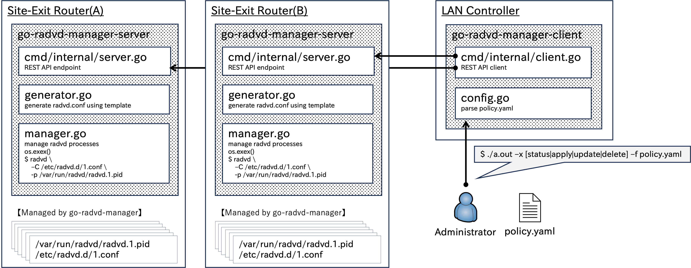

# go-radvd-manager
## Overivew

## Example
- Controller Side (client)
```
$ ./cli -x apply -f policy.yaml
[Local Policy]
ID(common)   Prefixes                                 Nexthop
--------------------------------------------------------------------------------
1            [2001:db8:1::/64 2001:db8:2::/64]        fc00:abcd::a
2            [2001:db8:3::/64 2001:db8:4::/64]        fc00:abcd::b
998          [::/0]                                   fc00:abcd::a
999          [::/0]                                   fc00:abcd::b

Rules                Members
--------------------------------------------------------------------------------
[1 998]              [fe80::1 fe80::2]
[2 999]              [fe80::3 fe80::4]

2025/01/24 16:09:43 + Created radvd instance (id: 999) on fc00:abcd::b
2025/01/24 16:09:43 + Created radvd instance (id: 2) on fc00:abcd::b
2025/01/24 16:09:43 + Created radvd instance (id: 1) on fc00:abcd::a
2025/01/24 16:09:43 + Created radvd instance (id: 998) on fc00:abcd::a
$ ./cli -x status -f policy.yaml 
[Local Policy]
ID(common)   Prefixes                                 Nexthop
--------------------------------------------------------------------------------
1            [2001:db8:1::/64 2001:db8:2::/64]        fc00:abcd::a
2            [2001:db8:3::/64 2001:db8:4::/64]        fc00:abcd::b
998          [::/0]                                   fc00:abcd::a
999          [::/0]                                   fc00:abcd::b

Rules                Members
--------------------------------------------------------------------------------
[1 998]              [fe80::1 fe80::2]
[2 999]              [fe80::3 fe80::4]

[Remote Status]
RouterID             ID(common)   PID      Routes                                   Preference   Clients
------------------------------------------------------------------------------------------------------------------------------------------------------
                     0            0        []                                       medium       []
fc00:abcd::a         1            645492   [2001:db8:1::/64 2001:db8:2::/64]        medium       [fe80::1 fe80::2]
fc00:abcd::a         998          645491   []                                       high         [fe80::1 fe80::2]

                     0            0        []                                       medium       []
fc00:abcd::b         999          83822    []                                       high         [fe80::3 fe80::4]
fc00:abcd::b         2            83821    [2001:db8:3::/64 2001:db8:4::/64]        medium       [fe80::3 fe80::4]
```

- Site-Exit Router Side (server)
    - Router(a)
    ```
    $ sudo ./server
    2025/01/24 16:09:29 INFO Starting HTTP server endpoint=[::]:12345
    2025/01/24 16:09:43 INFO [POST] component=radvdManagerServer from=[fc00:abcd::9296:f3ff:fe4a:568d]:48328
    2025/01/24 16:09:43 INFO [POST] component=radvdManagerServer from=[fc00:abcd::9296:f3ff:fe4a:568d]:48312
    2025/01/24 16:09:57 INFO [GET] component=radvdManagerServer from=[fc00:abcd::9296:f3ff:fe4a:568d]:39430
    2025/01/24 16:09:57 http: superfluous response.WriteHeader call from github.com/y-kzm/go-radvd-manager/cmd/internal.(*RadvdManagerServer).handleInstances (server.go:55)
    ```
    - Router(b)
    ```
    $ sudo ./server
    2025/01/24 16:09:40 INFO Starting HTTP server endpoint=[::]:12345
    2025/01/24 16:09:43 INFO [POST] component=radvdManagerServer from=[fc00:abcd::9296:f3ff:fe4a:568d]:48938
    2025/01/24 16:09:43 INFO [POST] component=radvdManagerServer from=[fc00:abcd::9296:f3ff:fe4a:568d]:48944
    2025/01/24 16:09:57 INFO [GET] component=radvdManagerServer from=[fc00:abcd::9296:f3ff:fe4a:568d]:45254
    2025/01/24 16:09:57 http: superfluous response.WriteHeader call from github.com/y-kzm/go-radvd-manager/cmd/internal.(*RadvdManagerServer).handleInstances (server.go:55)
    ```

    - Shut down server
    ```
    ^C2025/01/24 16:12:43 INFO Received signal, shutting down server
    2025/01/24 16:12:43 INFO Stopped radvd component=radvdManagerServer instance=1
    2025/01/24 16:12:43 INFO Stopped radvd component=radvdManagerServer instance=998
    2025/01/24 16:12:43 INFO Shutting down gracefully
    ```


